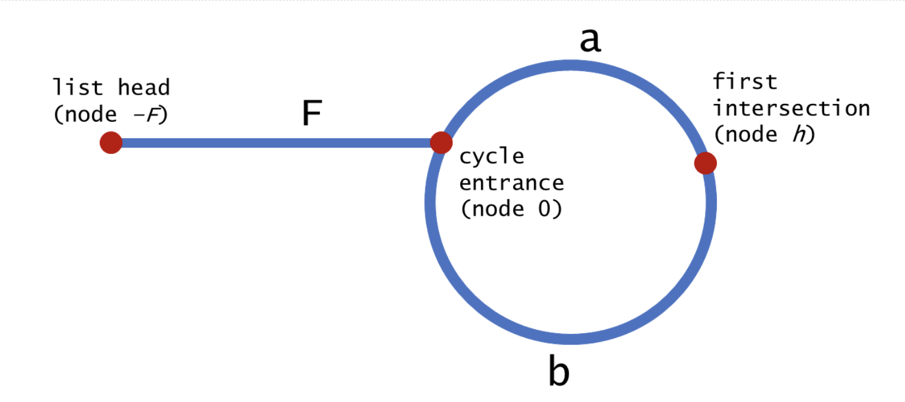

# 287. Find the Duplicate Number

### 1. [Description](https://leetcode.com/problems/find-the-duplicate-number/description/)

Given an array nums containing n + 1 integers where each integer is between 1 and n \(inclusive\), prove that at least one duplicate number must exist. Assume that there is only one duplicate number, find the duplicate one.

**Example 1:**

```text
Input: [1,3,4,2,2]
Output: 2
```

**Example 2:**

```text
Input: [3,1,3,4,2]
Output: 3
```

**Note:**

1. You **must not** modify the array \(assume the array is read only\).
2. You must use only constant, O\(1\) extra space.
3. Your runtime complexity should be less than _O_\(_n^_2\).
4. There is only one duplicate number in the array, but it could be repeated more than once.


### 2. Solution

Since it's not allowed to modify the array, sorting doesn't work. 

Besides, due to the requirements of O\(1\) space, hash table doesn't work.

Since the only space we could use is the input array itself, we could make use of the index and value of the array. However, we are not allowed to modify the array, so conversion between negative and positive doesn't work. Then what could we use? 

We could use the assumption that there must be one duplicate. If we use the array index and value as pointers, we could assume 2 pointers which forms a cycle.

Similar to 141. Linked List Cycle, we initialize 2 pointers, `slow` and `fast`:

* `slow` is moving one step forward each time, i.e. slow = input\[slow\]
* `fast` is moving 2 steps forward each time, i.e. fast = input\[input\[fast\]\]
* when `input[slow] == input[fast]`, the `slow` pointer catches up with the `fast` pointer. But that is not sure to be the start of loop which we are looking for.

How could we find the entry point of the loop?



As illustrated above, given the same amount of time, `fast` moves twice the speed of `slow` when they meet at node h:

2 \* \(F + a\) = F + a + b + a

2 \* F + 2 \* a = F + 2 \* a  + b

F = b

i.e. if we move one pointer from node h and another one from -F, they will pass the same distance \(F = b\) and reach the node 0 at the same time. 

i.e. they will reach the cycle entrance.

**Complexity:**


* Time: O\(n\)  

where n refers to the length of input array.

* Space: O\(1\) 

because it's done in-place



### 3. JAVA Implementation

```text
public int findDuplicate(int[] nums) {
    if (nums == null || nums.length == 0) {
        return 0;
    }
    
    int slow = nums[0];
    int fast = nums[0];
    do {
        slow = nums[slow];
        fast = nums[nums[fast]];
    } while (slow != fast)
    
    int start = nums[0];
    while (start != slow) {
        slow = nums[slow];
        start = nums[start];
    }
    
    return start;
}
```


### 4. Comment

* map the action of "move":
  * linked list: node = node.next;
  * array: index = input\[index\]

