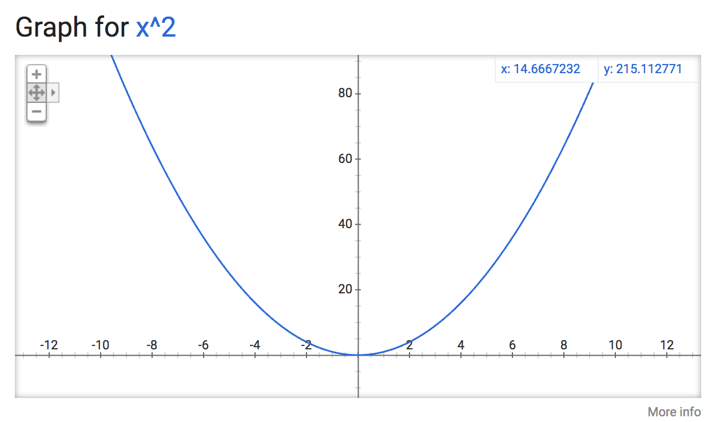

# 977. Squares of a Sorted Array

### 1.[ Description](https://leetcode.com/problems/squares-of-a-sorted-array/description/)

Given an array of integers `A` sorted in non-decreasing order, return an array of the squares of each number, also in sorted non-decreasing order.

**Example 1:**

```text
Input: [-4,-1,0,3,10]
Output: [0,1,9,16,100]
```

**Example 2:**

```text
Input: [-7,-3,2,3,11]
Output: [4,9,9,49,121]
```

**Note:**

1. `1 <= A.length <= 10000`
2. `-10000 <= A[i] <= 10000`
3. `A` is sorted in non-decreasing order.


### 2. Solution



As illustrated in the picture above, the trend of squares hits its min when x = 0. So to sort the squares of a non-descending array, the key is to find the number closest to 0, i.e. the smallest square. 

After getting the min square and put it at the start, we need to compare its two sides to add the smaller one in the result. Therefore, we need to pointers, `left` and `right`

* while `left` and `right` are not out of array's bound, we compare them:
  * if `input[left] square < intput[right] square`, add `input[left] square` to result and decrease `left` by 1
  * otherwise, add `input[right] square` to result and increase `right` by 1
* check if any pointer hasn't reach the bound, and append all remaining nums' square to result:
* return the result

**Complexity:**


* Time: O\(n\)  

where n represents the length of input array. Because in essence, we go through all elements and calculate their squares and append to result, which take O\(1\) \* n

* Space: O\(1\) 

only takes constant extra space for pointers etc.



### 3. JAVA Implementation

```text
public int[] sortedSquares(int[] A) {
    int pivot = 0;
    while (pivot < A.length) {
        if (A[pivot] < 0) {
            pivot++;
        } else {
            bresk;
        }
    }
    
    int left = pivot - 1;
    int[] result = new int[A.length];
    int index = 0;
    while (left >= 0 && pivot < A.length) {
        int leftSqr = (int) Math.pow(A[left], 2);
        int rightSqr = (int) Math.pow(A[pivot], 2);
        if (leftSqr <= rightSqr) {
            result[index++] = leftSqr; 
            left--;
        } else {
            result[index++] = rightSqr;
            pivot++;
        }
    }
    
    while (left >= 0) {
        int leftSqr = (int) Math.pow(A[left], 2);
        result[index++] = leftSqr;
    }
        
    while (pivot < A.length) {
        int rightSqr = (int) Math.pow(A[pivot], 2);
        result[index++] = rightSqr;
    }
    return result;
}
```


### 4. Analysis

* To calculate the square of a num,
  * return type of Math.pow\(num, 2\) is  **double**
  * num \* num

