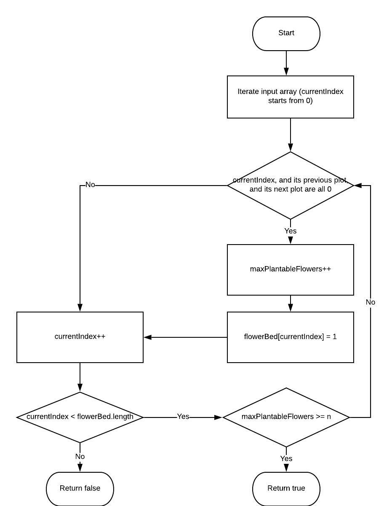

# 605. Can Place Flowers

### 1.[ Problem: ](https://leetcode.com/problems/can-place-flowers/description/)

Suppose you have a long flowerbed in which some of the plots are planted and some are not. However, flowers cannot be planted in adjacent plots - they would compete for water and both would die.

Given a flowerbed \(represented as an array containing 0 and 1, where 0 means empty and 1 means not empty\), and a number **n**, return if **n** new flowers can be planted in it without violating the no-adjacent-flowers rule.

**Example 1:**

```text
Input: flowerbed = [1,0,0,0,1], n = 1
Output: True
```

**Example 2:**

```text
Input: flowerbed = [1,0,0,0,1], n = 2
Output: False
```

**=&gt; Note:**

1. The input array won't violate no-adjacent-flowers rule.
2. The input array size is in the range of \[1, 20000\].
3. **n** is a non-negative integer which won't exceed the input array size.

### **2. Analysis:** 

In order to get the maximum amount of flowers we can plant, iterate all plots in the flowerbed. When there are 3 consecutive empty plots, the mid one could be planted.

**=&gt; In Essence**

When 3 consecutive index all map to value 0, chang the mid value to 1 and increase flower count by 1.

Note the edge case of _head_ and _tail_



### 3. Solution:

**Solution: Iteration**

**Steps**

1. iterate the array from 0
2. check if any 3 consecutive index map to 0 at the same time:
   1. if so, increase the flower count by 1 and change the value of middle position to 1 
   2. otherwise, do nothing
3. continue to the next element until the last element
4. check if the maximum plantable flower amount &gt;= input flower amount
   1. if so, return true because it's plausible
   2. otherwise, return false

**Complexity**

1. Time: O\(input.length\)  =&gt; optimization: O\(inputAmount\)


The fact is to iterate the input array.


2. Space: O\(1\)


No extra space is required.


### 4. JAVA Implementation:

```text
public boolean canPlaceFlowers(int[] flowerbed, int n) {
        return maxPlots(flowerbed) >= n;
}
    
private int maxPlots(int[] flowerbed) {
        if (flowerbed.length == 1) {
            return 1 - flowerbed[0];
        }
                
        int count = 0;
        int i = 0;
        if (flowerbed[i] == 0 && flowerbed[i + 1] == 0) {
            count++;
            flowerbed[i] = 1;
        }
        i++;
        while (i < flowerbed.length - 1) {
            if (flowerbed[i - 1] == 0 && flowerbed[i + 1] == 0 && flowerbed[i] == 0) {
                count++;
                flowerbed[i] = 1;
            }
            i++;
        }
        
        i--;
        if (i > 0 && flowerbed[i] == 0 && flowerbed[i + 1] == 0) {
            count++;
            flowerbed[i + 1] = 1;
        }
        
        return count;
}

```

### 5. Note:

* ArrayOutOfBound Error: edge case of head and tail element.

