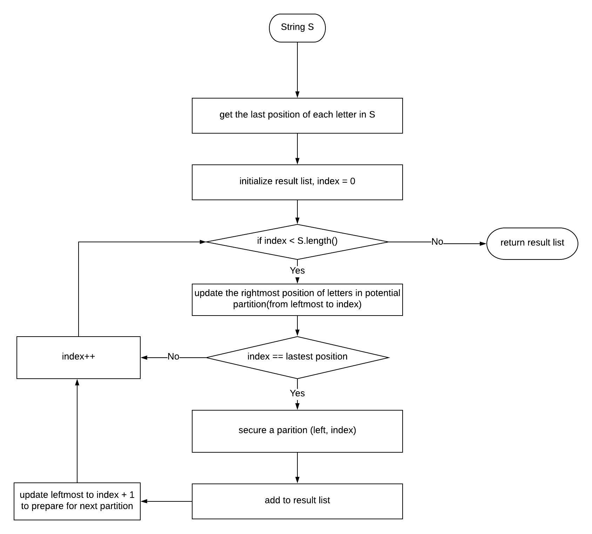

# 763. Partition Labels

### 1.[ Problem](https://leetcode.com/problems/partition-labels/description/): 

A string `S` of lowercase letters is given. We want to partition this string into as many parts as possible so that each letter appears in at most one part, and return a list of integers representing the size of these parts.

**Example 1:**

```text
Input: S = "ababcbacadefegdehijhklij"
Output: [9,7,8]
Explanation:
The partition is "ababcbaca", "defegde", "hijhklij".
This is a partition so that each letter appears in at most one part.
A partition like "ababcbacadefegde", "hijhklij" is incorrect, because it splits S into less parts.
```

**=&gt; Note:**

1. `S` will have length in range `[1, 500]`.
2. `S` will consist of lowercase letters \(`'a'` to `'z'`\) only.

### **2. Analysis:** 

In order to make each letter only appears in one partition + get max partitioned parts, 

for each letter in this string \(e.g. letter1\), we should partition from its first appearance to its last appearance at least.

If another letter \(e.g.letter2\) first appears  between letter1's first and last position

+ letter2 last appears after letter1's last position 

=&gt; this partitioned part is expanded.

i.e.  letter1.first &lt; letter2.first &lt; letter1.last &lt; letter2.last =&gt; \[letter1.first, letter2.last\]



### 3. Solution:

**Solution: Two Pointers**

**Steps**

1. get all the index of each letter's last appearance in this string
2. iterate the string from index = 0
   1. get the temporary rightmost index of the potential part before currentIndex
   2. if currentIndex == the temp rightmost index of a potential part?
      1. if so, add the part is indeed a partition =&gt; add \(previous part's next, currentIndex\) in result =&gt; move the leftmostIndex = rightmostIndex of current part + 1
      2. otherwise, continue
3. return the result list

**Complexity**

1. Time: O\(input.length\)  


The fact is to iterate the input the string.


2. Space: O\(1\)


In need of a char array of size 26 to store all the index of letters' last appearance in this string


### 4. JAVA Implementation:

```text
public List<Integer> partitionLabels(String S) {
    List<Integer> res = new ArrayList<>();
    int[] lasts = new int[26];
    for (int i = 0; i < S.length(); i++) {
        lasts[S.charAt(i) - 'a'] = i;
    }
        
    int anchor = 0;
    int tmp = 0;
    for (int i = 0; i < S.length(); i++) {
        tmp = Math.max(tmp, lasts[S.charAt(i) - 'a']);
        if (i == tmp) {
            res.add(i - anchor + 1);
            anchor = i + 1;
        }
    }
        
    return res;
}
```

### 5. Note:

