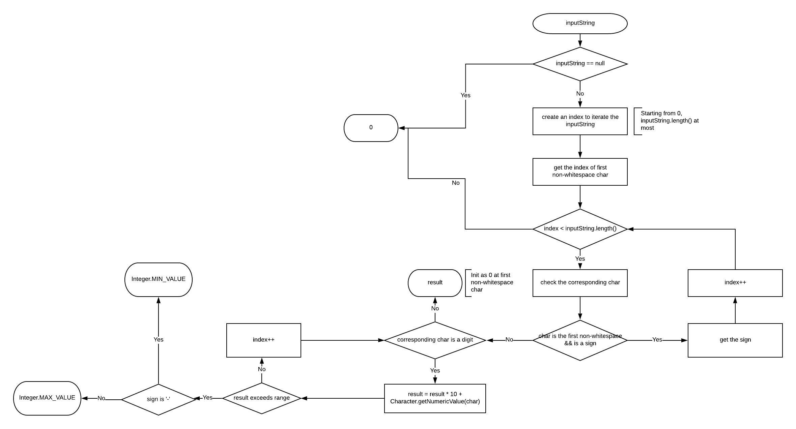

# 8. String to Integer \(atoi\)

### 1.[ Problem:](https://leetcode.com/problems/string-to-integer-atoi/description/) 

Implement `atoi` which converts a string to an integer.


**atoi=ASCII to integer:** is a function in the C programming language that converts a string into an integer numerical representation.


The function first discards as many whitespace characters as necessary until the first non-whitespace character is found. Then, starting from this character, takes an optional initial plus or minus sign followed by as many numerical digits as possible, and interprets them as a numerical value.

The string can contain additional characters after those that form the integral number, which are ignored and have no effect on the behavior of this function.

If the first sequence of non-whitespace characters in str is not a valid integral number, or if no such sequence exists because either str is empty or it contains only whitespace characters, no conversion is performed.

If no valid conversion could be performed, a zero value is returned.

**Example 1:**

```text
Input: "42"
Output: 42
```

**Example 2:**

```text
Input: "   -42"
Output: -42
Explanation: The first non-whitespace character is '-', which is the minus sign.
             Then take as many numerical digits as possible, which gets 42.
```

**Example 3:**

```text
Input: "4193 with words"
Output: 4193
Explanation: Conversion stops at digit '3' as the next character is not a numerical digit.
```

**Example 4:**

```text
Input: "words and 987"
Output: 0
Explanation: The first non-whitespace character is 'w', which is not a numerical 
             digit or a +/- sign. Therefore no valid conversion could be performed.
```

**Example 5:**

```text
Input: "-91283472332"
Output: -2147483648
Explanation: The number "-91283472332" is out of the range of a 32-bit signed integer.
             Thefore INT_MIN (−231) is returned.
```

**=&gt; Note:**

* Only the space character `' '` is considered as whitespace character.
* Assume we are dealing with an environment which could only store integers within the 32-bit signed integer range: \[−2^31,  2^31 − 1\]. If the numerical value is out of the range of representable values, INT\_MAX \(2^31 − 1\) or INT\_MIN \(−2^31\) is returned.

### **2. Analysis:** 



#### **=&gt; Things to be clarified**

1. When it comes to "Integer", first confirm its range. In this problem, it means \[Integer.MIN\_VALUE, Integer.MAX\_VALUE\], i.e. \[-2^31, 2^31 - 1\]
2. signs are optional

### 3. Solution:

**Assumptions**

Only return **INTEGERS**

**Complexity**

1. Time: O\(inputString.length\(\)\) 


The fact is to iterate the char array of input string and convert.


  2. Space: O\(1\)

### 4. JAVA Implementation:

```text
public int myAtoi(String str) {
        if (str == null || str.length() == 0) {
            return 0;
        }
        
        int index = 0;
        while (index < str.length()) {
            if (str.charAt(index) == ' ') {
                index++;
            } else {
                break;
            }
        }
        
        long res = 0;
        int sign = 1;
        if (index < str.length()) {
            if (str.charAt(index) == '+') {
                index++;
            } else if (str.charAt(index) == '-') {
                sign = -1;
                index++;
            }
        }
        
        if (index == str.length() || !Character.isDigit(str.charAt(index))) {
            return 0;
        }
        
        while (index < str.length() && Character.isDigit(str.charAt(index))) {
            res = res * 10 + Character.getNumericValue(str.charAt(index));
            if (sign < 0 && res * sign <= Integer.MIN_VALUE) {
                return Integer.MIN_VALUE;
            } else if (sign > 0 && res >= Integer.MAX_VALUE) {
                return Integer.MAX_VALUE;
            }
            index++;
        }
        
        res *= sign;
        return (int) res;
    }
```

### 5. Note:

* corner cases:
  * inputString == null
  * exceeds range:
    * number &gt; Integer.MAX\_VALUE \|\| number &lt; Integer.MIN\_VALUE
    * number &gt; Long.MAX\_VALUE \|\| number &lt; Long.MIN\_VALUE =&gt; use LONG for results and stop adding up the result once it exceeds the range of INTEGERS
* if use Long as result type, remember to convert it back to Integer type

