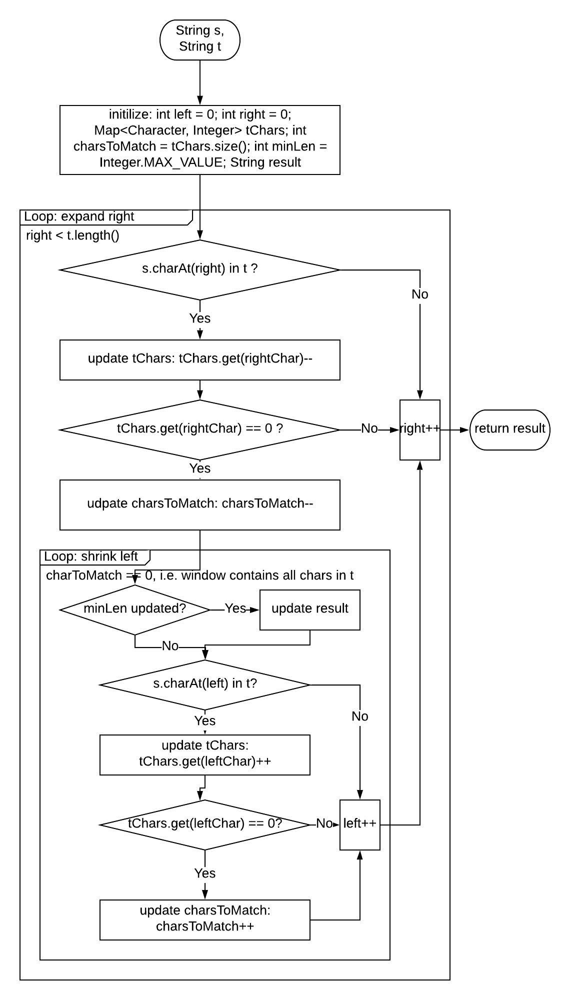

# 76. Minimum Window Substring

### 1.[ Problem:](https://leetcode.com/problems/minimum-window-substring/description/) 

Given a string S and a string T, find the minimum window in S which will contain all the characters in T in complexity O\(n\).

**Example:**

```text
Input: S = "ADOBECODEBANC", T = "ABC"
Output: "BANC"
```

**=&gt; Note:**

* If there is no such window in S that covers all characters in T, return the empty string `""`.
* If there is such window, you are guaranteed that there will always be only one unique minimum window in S.

### **2. Analysis:** 

Sliding Window: marked by 2 pointers

* right: the end of the window, move forward to expand until the window contains all chars in T
* left: the start of the window, move forward to shrink until the window no longer contains all chars in T



#### **=&gt; Things to be clarified**

1. Move one pointer at a time ONLY

### 3. Solution:

**Assumptions**

If there is such window, there will be ONLY 1 min window.

**Complexity**

1. Time: O\(t.length\(\) + s.length\(\)\) 
2. 2. Space: O\(t.length\(\) + s.length\(\)\)

### 4. JAVA Implementation:

```text
public String minWindow(String s, String t) {
        if (s == null || t == null || s.length() < t.length()) {
            return "";
        }
        
        Map<Character, Integer> map = new HashMap<>();
        map = getMap(t);
        int toMatch = map.size();
        int globalMin = Integer.MAX_VALUE;
        String res = "";
        
        int left = 0;
        for (int right = 0; right < s.length(); right++) {
            char rChar = s.charAt(right);
            if (map.containsKey(rChar)) {
                int rCount = map.get(rChar);
                map.put(rChar, --rCount);
                if (rCount == 0) {
                    toMatch--;
                }
            }
            
            while (toMatch == 0) {
                if (right - left + 1 < globalMin) {
                    globalMin = right - left + 1;
                    res = s.substring(left, right + 1);
                }
                char lChar = s.charAt(left);
                if (map.containsKey(lChar)) {
                    int lCount = map.get(lChar);
                    map.put(lChar, ++lCount);
                    if (lCount > 0) {
                        toMatch++;
                    }
                }
                left++;
            }
        }
        
        return res;
}
    
private Map<Character, Integer> getMap(String t) {
    Map<Character, Integer> map = new HashMap<>();
    for (char c: t.toCharArray()) {
        map.put(c, map.getOrDefault(c, 0) + 1);
    }
    return map;
}
```

### 5. Note:

* sampleString.substring\(i, j\) will return the substring within index \[i, j\)

e.g. "abcde".substring\(0,2\) = "ab"

