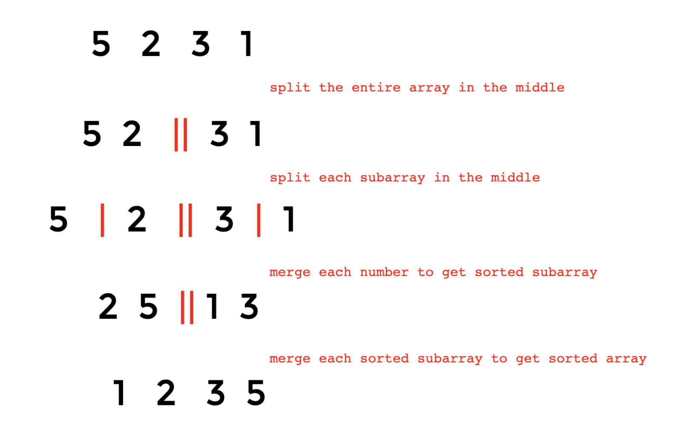

# Merge Sort

## 1. WHAT

### 1.1 Overview

Merge sort is an algorithm that sorts an array in a giving order \(mostly ascending\) by:

* splitting the input into 2 halves 
  * as middle as possible
* mergeSorting the 2 halves respectively...until there is ONLY one element in the splitted part
* merging the sorted 2 halves into one 
  * compare from the top of each half
  * select the smaller one \(for ascending\) 
  * add it to the final result and take its next element for future comparison

### 1.2 Time Complexity

O\(nlogn\)

* split: 
  * since elements in arrays are randomly accessible, we could find the mid index in O\(1\) 
  * since there are n elements in arrays, binary splitting takes log\(n\) times to make splitted part contain ONLY 1 element 
  * in general, splitting takes O\(logn\) time
* merge:
  * to compare and sort splitted subarrays, we have to iterate all the elements of these subarrays -&gt; in total, each round takes O\(n\)
  * it takes log\(n\) rounds merging from one element in each subarray to an entirely sorted array
  * in total, merging takes O\(nlogn\) time

### 1.3 Space Complexity

O\(n\)

* Breakpoint at recursion call, we use extra space for call stack to store element\#: n/2 + n/4 + n/8 + ... + 1 = O\(n\)

## 2. WHY

Merge sort is a stable, comparison-based sorting algorithm.

## 3. HOW

Assumptions to clarify: ascending or descending?

### 3.1 Merge Sorted Parts

3.1.1 Merge 2 Sorted Arrays \[[LeetCode 88](https://app.gitbook.com/@alittlebit/s/algorithm-problems-and-how-to-solve-them/array/88.-merge-sorted-array) & LintCode 6\]

3.1.2 Merge K Sorted Arrays \[LintCode 486\]

3.1.3 Merge 2 Sorted Lists \[LeetCode 21 & LintCode 165\]

3.1.4 Merge K Sorted Lists \[LintCode 104\]

### 3.2 MergeSort 

3.2.1 MergeSort 2 arrays to 1 array \[LintCode 464\]

3.2.2 MergeSort 2 arrays to 1 list \[LeetCode 912\]

3.2.3 MergeSort 2 list to 1 list [\[LeetCode 148\]](https://app.gitbook.com/@alittlebit/s/algorithm-problems-and-how-to-solve-them/list/148.-sort-list)

### 3.3 Reorder Strings

3.3.1 "a1b2c3d4e5" -&gt; "abcde12345"

substring\(startIndex, endIndex\); endIndex excluded.

3.3.2 "abcde12345" -&gt; "a1b2c3d4e5"

## 

